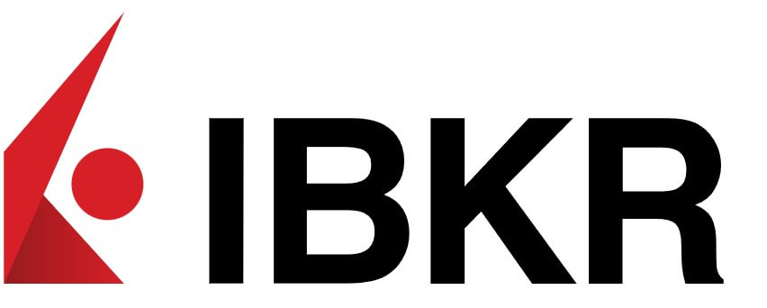

#  IBKR FastAPI Trading API
<p align="center">     </p>

A modern FastAPI backend that integrates AI hedge fund decision-making with Interactive Brokers Web API. This allows algorithmic trading strategies to be executed automatically using real-time market data. Using the [AI-Hedge-Fund](https://github.com/virattt/ai-hedge-fund) repo with some of my own changes. My full write up with more technical details are in this [📜Medium Article📜](https://medium.com/@aristidesai/interactive-broker-web-api-ec01e6cf3de2). If you enjoy this project and wish to see more, please follow me on [X/Twitter❤️](https://x.com/aristidesai)

---

## Features

#### - 🔐 OAuth2 authentication with IBKR
#### - 🔎 Dynamic conid (contract ID) lookup via `/iserver/secdef/search`
#### - 📈 Trade execution (buy/sell) with live market orders
#### - ⚡ Clean FastAPI REST interface for external services or agents

---

## Project Structure

```
├── ibkr_client.py        # IBKR Web API Client for authentication and order placement
├── portfolio_manager.py  # Integrates AI decisions and places trades via IBKR
├── trade_decision.py     # Dataclass for structured trade decisions
├── main.py               # FastAPI wrapper with trading endpoints
```

---

## API Endpoints

#### `GET /health`
Returns a simple health check.

#### `GET /conid?symbol=XYZ`
Dynamically looks up IBKR conid for a given symbol (e.g., AAPL, TSLA).

Response:
```json
{
  "symbol": "AAPL",
  "conid": 265598
}
```

#### `POST /trade`
Submit a trade via IBKR Web API using market order:

Request:
```json
{
  "symbol": "AAPL",
  "action": "buy",
  "quantity": 5
}
```

Response:
```json
{
  "status": "success",
  "response": { "order_id": "..." }
}
```

---

### Setup Instructions

1. **Install dependencies**
```bash
pip install fastapi uvicorn requests
```

2. **Add your credentials** (recommended via environment variables):
```python
CLIENT_ID = "your_client_id"
CLIENT_SECRET = "your_client_secret"
ACCOUNT_ID = "your_ibkr_account_id"
BASE_URL = "https://api.interactivebrokers.com"
```

3. **Run the API server**
```bash
uvicorn main:app --reload
```

---

## References

- [AI Hedge Fund (virattt)](https://github.com/virattt/ai-hedge-fund)
- [IBKR Web API Docs](https://www.interactivebrokers.com/campus/ibkr-api-page/web-api-trading/)

---

## License
MIT License

---

## Contact
Please contact me on [X/Twitter❤️](https://x.com/aristidesai) for collaboration, integrations, or support. 
